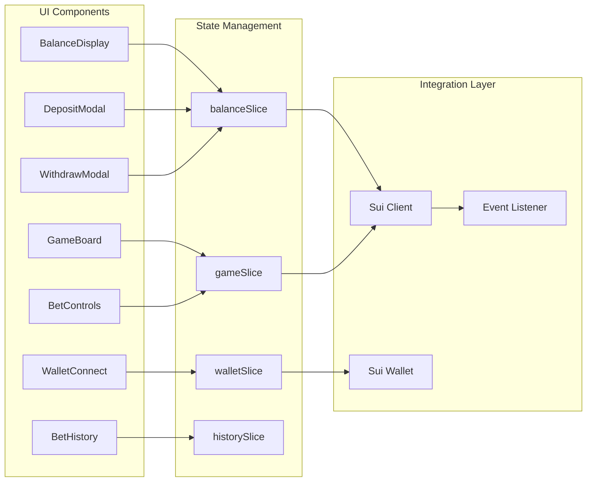
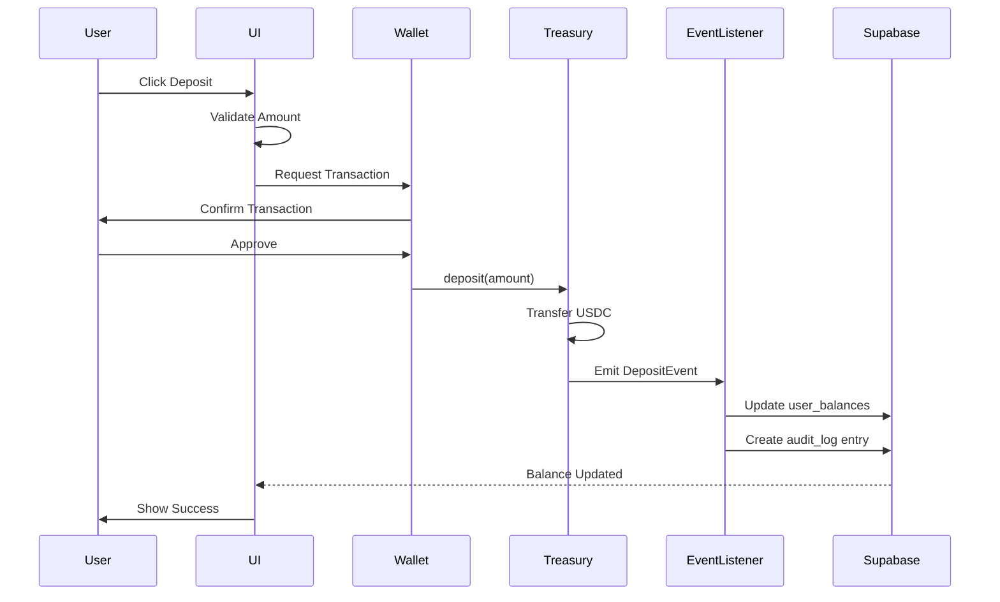
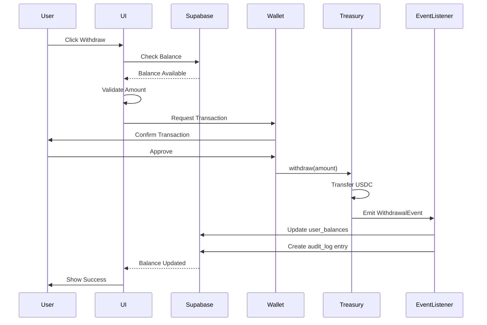
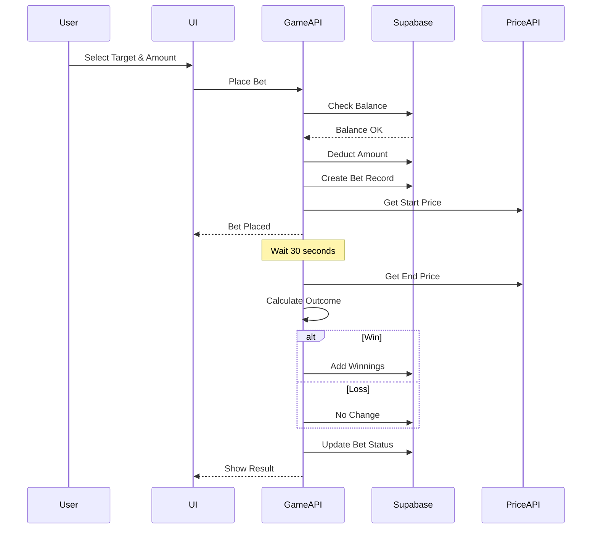
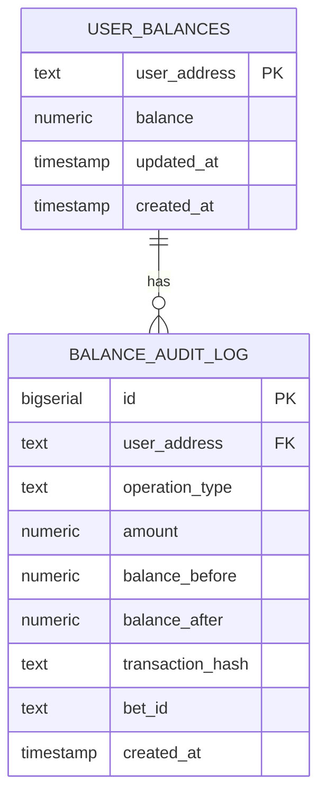
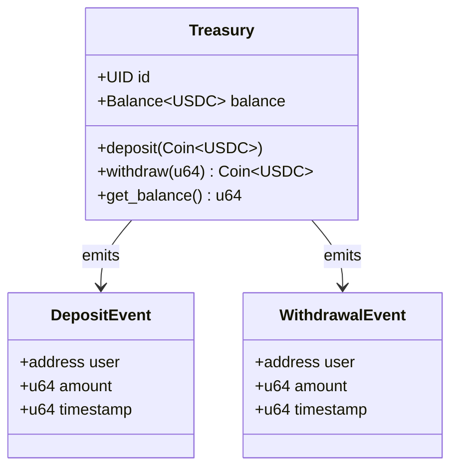
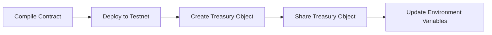
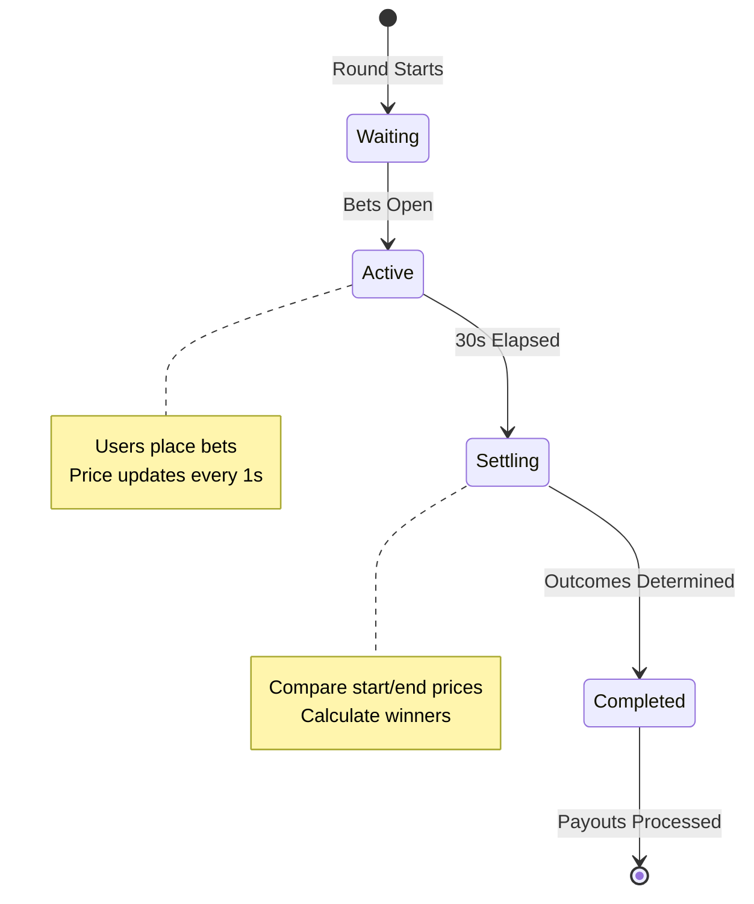
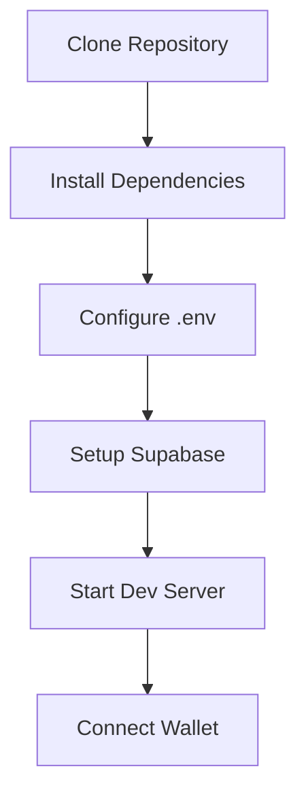
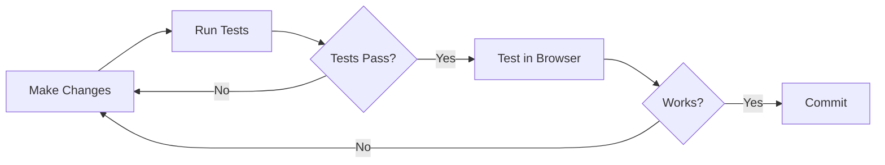

# Overflow - BTC Price Prediction Game

Overflow is a decentralized real-time BTC price prediction game built on Sui Blockchain. Users deposit USDC tokens to their house balance and place bets on Bitcoin price movements within 30-second rounds. The system combines on-chain treasury management with off-chain game logic for optimal performance and user experience.

## Core Features

- Real-time BTC price prediction with 30-second rounds
- USDC-based betting system on Sui testnet
- On-chain treasury for secure deposit/withdrawal operations
- Off-chain game logic for fast bet placement and settlement
- Live price chart with historical data visualization
- Multiple betting targets with configurable multipliers
- Comprehensive audit logging for all balance operations
- Event-driven balance synchronization between blockchain and database

## System Architecture

The application follows a hybrid architecture combining on-chain treasury operations with off-chain game logic. This design optimizes for security (deposits/withdrawals on-chain) and performance (game logic off-chain).

### High-Level Architecture

```mermaid
graph TB
    subgraph "Client Layer"
        UI[React Components]
        Store[Zustand State]
        Hooks[Custom Hooks]
    end
    
    subgraph "Wallet Integration"
        DappKit[@mysten/dapp-kit]
        WalletAdapters[Sui Wallet Adapters]
    end
    
    subgraph "Blockchain Layer"
        SuiSDK[@mysten/sui.js]
        Treasury[Treasury Contract]
        USDC[USDC Token]
        Events[Blockchain Events]
    end
    
    subgraph "API Layer"
        BalanceAPI[Balance API]
        GameAPI[Game API]
        EventListener[Event Listener]
    end
    
    subgraph "Data Layer"
        Supabase[(Supabase PostgreSQL)]
        PriceAPI[Price Feed API]
    end
    
    UI --> Store
    UI --> Hooks
    Hooks --> DappKit
    DappKit --> WalletAdapters
    DappKit --> SuiSDK
    
    SuiSDK --> Treasury
    Treasury --> USDC
    Treasury --> Events
    
    Store --> BalanceAPI
    Store --> GameAPI
    
    BalanceAPI --> Supabase
    GameAPI --> Supabase
    GameAPI --> PriceAPI
    
    EventListener --> Events
    EventListener --> Supabase
```

### Component Architecture



### Data Flow Diagrams

#### Deposit Flow



#### Withdrawal Flow



#### Bet Placement Flow



## Technical Stack

### Frontend
- **Next.js 14**: React framework with App Router for server-side rendering
- **TypeScript**: Type-safe development with strict mode enabled
- **Tailwind CSS**: Utility-first CSS framework for responsive design
- **Zustand**: Lightweight state management with minimal boilerplate
- **Recharts**: Composable charting library for price visualization
- **@mysten/dapp-kit**: Official Sui wallet integration with React hooks

### Blockchain
- **Sui Blockchain**: Layer 1 blockchain with Move smart contracts
- **@mysten/sui.js**: TypeScript SDK for Sui blockchain interactions
- **Sui Move**: Smart contract language for treasury implementation
- **USDC**: Stablecoin token for deposits and betting

### Backend
- **Next.js API Routes**: Serverless API endpoints for game logic
- **Supabase**: PostgreSQL database with real-time subscriptions
- **Node.js**: Runtime environment for event listener service

### Development
- **Jest**: Testing framework with coverage reporting
- **@testing-library/react**: Component testing utilities
- **fast-check**: Property-based testing library
- **ESLint**: Code linting with Next.js configuration
- **TypeScript Compiler**: Type checking and compilation

## Prerequisites

- Node.js 18+ and npm
- A Sui wallet (Sui Wallet, Suiet, Ethos, etc.) for testing
- Sui testnet SUI tokens for gas (get from [Sui Testnet Faucet](https://discord.com/channels/916379725201563759/971488439931392130))
- Sui testnet USDC tokens for gameplay

## Getting Started

### 1. Install Dependencies

```bash
npm install
```

### 2. Set Up Environment Variables

Copy the example environment file and configure it:

```bash
cp .env.example .env
```

Edit `.env` to configure your settings. The default values point to the deployed testnet contracts.

**Required Environment Variables:**
- `NEXT_PUBLIC_SUI_NETWORK`: Network to use (testnet, mainnet, devnet)
- `NEXT_PUBLIC_SUI_RPC_ENDPOINT`: Sui RPC endpoint URL
- `NEXT_PUBLIC_TREASURY_PACKAGE_ID`: Deployed treasury contract package ID
- `NEXT_PUBLIC_TREASURY_OBJECT_ID`: Treasury shared object ID
- `NEXT_PUBLIC_USDC_TYPE`: USDC token type on Sui
- `NEXT_PUBLIC_SUPABASE_URL`: Your Supabase project URL
- `NEXT_PUBLIC_SUPABASE_ANON_KEY`: Your Supabase anonymous key

### 3. Set Up Supabase Database

The application uses Supabase for off-chain data storage. You need to:

1. Create a new Supabase project at [supabase.com](https://supabase.com)
2. Install Supabase CLI: `npm install -g supabase`
3. Link to your project: `supabase link --project-ref your-project-ref`
4. Push the database schema: `supabase db push`
5. Update `.env` with your Supabase URL and anon key

### 4. Start the Development Server

```bash
npm run dev
```

Open [http://localhost:3000](http://localhost:3000) in your browser.

### 5. Connect Your Sui Wallet

1. Install a Sui wallet extension (Sui Wallet, Suiet, or Ethos)
2. Create or import a wallet
3. Switch to Sui testnet
4. Get testnet SUI from the [faucet](https://discord.com/channels/916379725201563759/971488439931392130)
5. Click "Connect Sui Wallet" in the app

### 6. Get Testnet USDC

To play the game, you need testnet USDC tokens. You can:
- Use the Sui testnet faucet to get test USDC
- Or contact the project maintainers for testnet USDC

## Project Structure

```
overflow/
├── app/                          # Next.js App Router
│   ├── api/                      # API Routes
│   │   └── balance/              # Balance management endpoints
│   │       ├── deposit/          # Deposit endpoint
│   │       ├── withdraw/         # Withdrawal endpoint
│   │       ├── bet/              # Bet placement endpoint
│   │       ├── win/              # Win payout endpoint
│   │       ├── events/           # Event listener endpoint
│   │       └── [address]/        # Balance query endpoint
│   ├── layout.tsx                # Root layout with providers
│   ├── page.tsx                  # Main game page
│   ├── providers.tsx             # Client-side providers
│   └── globals.css               # Global styles
│
├── components/                   # React Components
│   ├── wallet/                   # Wallet integration
│   │   ├── WalletConnect.tsx     # Wallet connection button
│   │   └── WalletInfo.tsx        # Wallet information display
│   ├── balance/                  # Balance management
│   │   ├── BalanceDisplay.tsx    # Balance display component
│   │   ├── DepositModal.tsx      # Deposit modal
│   │   └── WithdrawModal.tsx     # Withdrawal modal
│   ├── game/                     # Game components
│   │   ├── GameBoard.tsx         # Main game board
│   │   ├── BetControls.tsx       # Bet placement controls
│   │   ├── TargetGrid.tsx        # Betting targets grid
│   │   ├── LiveChart.tsx         # Price chart
│   │   ├── RoundTimer.tsx        # Round countdown timer
│   │   └── ActiveRound.tsx       # Active round display
│   ├── history/                  # Bet history
│   │   ├── BetHistory.tsx        # Bet history list
│   │   └── BetCard.tsx           # Individual bet card
│   └── ui/                       # Reusable UI components
│       ├── Button.tsx            # Button component
│       ├── Card.tsx              # Card component
│       ├── Modal.tsx             # Modal component
│       ├── Toast.tsx             # Toast notification
│       └── LoadingSpinner.tsx    # Loading indicator
│
├── lib/                          # Core Libraries
│   ├── sui/                      # Sui blockchain integration
│   │   ├── client.ts             # Sui client configuration
│   │   ├── config.ts             # Network configuration
│   │   ├── wallet.ts             # Wallet integration
│   │   └── event-listener.ts     # Event listener service
│   ├── store/                    # State management (Zustand)
│   │   ├── index.ts              # Store configuration
│   │   ├── walletSlice.ts        # Wallet state
│   │   ├── balanceSlice.ts       # Balance state
│   │   ├── gameSlice.ts          # Game state
│   │   └── historySlice.ts       # Bet history state
│   ├── balance/                  # Balance management
│   │   └── synchronization.ts    # Balance sync logic
│   ├── supabase/                 # Supabase client
│   │   └── client.ts             # Supabase configuration
│   ├── utils/                    # Utility functions
│   │   ├── constants.ts          # Application constants
│   │   ├── formatters.ts         # Data formatters
│   │   ├── errors.ts             # Error handling
│   │   └── priceFeed.ts          # Price feed integration
│   └── logging/                  # Logging utilities
│       └── error-logger.ts       # Error logging
│
├── sui-contracts/                # Sui Move Smart Contracts
│   ├── sources/                  # Contract source files
│   │   └── treasury.move         # Treasury contract
│   ├── build/                    # Compiled contracts
│   ├── Move.toml                 # Move package manifest
│   └── Move.lock                 # Move dependencies lock
│
├── supabase/                     # Supabase Configuration
│   ├── migrations/               # Database migrations
│   │   ├── 001_create_user_balances.sql
│   │   ├── 002_create_balance_audit_log.sql
│   │   ├── 003_create_balance_procedures.sql
│   │   └── 004_create_reconciliation_procedure.sql
│   ├── scripts/                  # Database scripts
│   │   ├── verify-setup.ts       # Verify database setup
│   │   └── apply-migration.ts    # Apply migrations
│   └── __tests__/                # Database tests
│       ├── user_balances.test.ts
│       ├── balance_audit_log.test.ts
│       └── balance_procedures.test.ts
│
├── types/                        # TypeScript Type Definitions
│   ├── sui.ts                    # Sui-specific types
│   ├── game.ts                   # Game-related types
│   ├── bet.ts                    # Bet-related types
│   └── flow.ts                   # Legacy Flow types
│
├── scripts/                      # Utility Scripts
│   └── verify-deposit-withdrawal.ts  # Test deposit/withdrawal
│
├── .kiro/                        # Kiro IDE Configuration
│   └── specs/                    # Project specifications
│       └── sui-migration/        # Migration documentation
│
├── .env                          # Environment variables
├── .env.example                  # Environment template
├── package.json                  # NPM dependencies
├── tsconfig.json                 # TypeScript configuration
├── tailwind.config.js            # Tailwind CSS configuration
├── next.config.ts                # Next.js configuration
├── jest.config.js                # Jest configuration
└── README.md                     # This file
```

## Database Schema

### Entity Relationship Diagram



### Table Definitions

#### user_balances

Stores the current house balance for each user address.

| Column | Type | Constraints | Description |
|--------|------|-------------|-------------|
| user_address | TEXT | PRIMARY KEY | Sui wallet address |
| balance | NUMERIC(20,8) | NOT NULL, >= 0 | Current USDC balance |
| updated_at | TIMESTAMP | DEFAULT NOW() | Last update timestamp |
| created_at | TIMESTAMP | DEFAULT NOW() | Account creation timestamp |

#### balance_audit_log

Comprehensive audit trail for all balance operations.

| Column | Type | Constraints | Description |
|--------|------|-------------|-------------|
| id | BIGSERIAL | PRIMARY KEY | Auto-incrementing ID |
| user_address | TEXT | NOT NULL | Sui wallet address |
| operation_type | TEXT | NOT NULL | Operation type (deposit, withdrawal, bet, win) |
| amount | NUMERIC(20,8) | NOT NULL | Operation amount |
| balance_before | NUMERIC(20,8) | NOT NULL | Balance before operation |
| balance_after | NUMERIC(20,8) | NOT NULL | Balance after operation |
| transaction_hash | TEXT | NULL | Blockchain transaction hash |
| bet_id | TEXT | NULL | Associated bet ID |
| created_at | TIMESTAMP | DEFAULT NOW() | Operation timestamp |

### Stored Procedures

#### update_balance_with_audit

Atomically updates user balance and creates audit log entry.

```sql
CREATE OR REPLACE FUNCTION update_balance_with_audit(
    p_user_address TEXT,
    p_amount NUMERIC,
    p_operation_type TEXT,
    p_transaction_hash TEXT DEFAULT NULL,
    p_bet_id TEXT DEFAULT NULL
) RETURNS void
```

#### reconcile_balance

Reconciles user balance with blockchain state.

```sql
CREATE OR REPLACE FUNCTION reconcile_balance(
    p_user_address TEXT,
    p_expected_balance NUMERIC
) RETURNS TABLE(
    discrepancy NUMERIC,
    current_balance NUMERIC,
    expected_balance NUMERIC
)
```

## Smart Contract Architecture

### Treasury Contract

The treasury contract manages USDC deposits and withdrawals using Sui Move.

#### Contract Structure



#### Key Functions

**deposit**
```move
public entry fun deposit<T>(
    treasury: &mut Treasury<T>,
    payment: Coin<T>,
    ctx: &mut TxContext
)
```
Deposits USDC tokens into the treasury and emits a DepositEvent.

**withdraw**
```move
public entry fun withdraw<T>(
    treasury: &mut Treasury<T>,
    amount: u64,
    ctx: &mut TxContext
): Coin<T>
```
Withdraws USDC tokens from the treasury and emits a WithdrawalEvent.

**get_balance**
```move
public fun get_balance<T>(treasury: &Treasury<T>): u64
```
Returns the current USDC balance in the treasury.

#### Event Structures

**DepositEvent**
```move
struct DepositEvent has copy, drop {
    user: address,
    amount: u64,
    timestamp: u64
}
```

**WithdrawalEvent**
```move
struct WithdrawalEvent has copy, drop {
    user: address,
    amount: u64,
    timestamp: u64
}
```

### Contract Deployment Process



## Game Mechanics

### Round System



### Betting Targets

The game offers multiple betting targets with different multipliers based on price movement probability:

| Target | Price Movement | Multiplier | Probability |
|--------|---------------|------------|-------------|
| Target 1 | +0.1% to +0.3% | 2.5x | ~40% |
| Target 2 | +0.3% to +0.5% | 5.0x | ~20% |
| Target 3 | +0.5% to +1.0% | 10.0x | ~10% |
| Target 4 | -0.1% to -0.3% | 2.5x | ~40% |
| Target 5 | -0.3% to -0.5% | 5.0x | ~20% |
| Target 6 | -0.5% to -1.0% | 10.0x | ~10% |

### Payout Calculation

```
Payout = Bet Amount × Multiplier (if target hit)
Payout = 0 (if target missed)
```

### House Balance System

The house balance system enables fast bet placement without blockchain transactions:

1. User deposits USDC to treasury (on-chain)
2. Event listener credits house balance (off-chain)
3. User places bets using house balance (off-chain)
4. Winnings credited to house balance (off-chain)
5. User withdraws to wallet (on-chain)

This hybrid approach optimizes for:
- Security: Deposits/withdrawals secured by smart contract
- Performance: Instant bet placement without gas fees
- User Experience: No wallet confirmation for each bet

## Testing

### Run Frontend Tests

```bash
npm test
```

### Run Tests with Coverage

```bash
npm run test:coverage
```

### Test Deposit and Withdrawal

```bash
npm run verify-deposit-withdrawal
```

## Network Configuration

The application supports multiple Sui networks. Configure via `NEXT_PUBLIC_SUI_NETWORK` environment variable.

| Network | Description | RPC Endpoint |
|---------|-------------|--------------|
| testnet | Sui testnet (default) | https://fullnode.testnet.sui.io:443 |
| mainnet | Sui mainnet | https://fullnode.mainnet.sui.io:443 |
| devnet | Sui devnet | https://fullnode.devnet.sui.io:443 |
| localnet | Local Sui node | http://localhost:9000 |

## Environment Variables

### Required Variables

| Variable | Description | Example |
|----------|-------------|---------|
| `NEXT_PUBLIC_SUI_NETWORK` | Sui network to connect to | `testnet` |
| `NEXT_PUBLIC_SUI_RPC_ENDPOINT` | Sui RPC endpoint URL | `https://fullnode.testnet.sui.io:443` |
| `NEXT_PUBLIC_TREASURY_PACKAGE_ID` | Treasury contract package ID | `0x...` |
| `NEXT_PUBLIC_TREASURY_OBJECT_ID` | Treasury shared object ID | `0x...` |
| `NEXT_PUBLIC_USDC_TYPE` | USDC token type on Sui | `0x...::usdc::USDC` |
| `NEXT_PUBLIC_SUPABASE_URL` | Supabase project URL | `https://xxx.supabase.co` |
| `NEXT_PUBLIC_SUPABASE_ANON_KEY` | Supabase anonymous key | `eyJ...` |

### Optional Variables

| Variable | Description | Default |
|----------|-------------|---------|
| `NEXT_PUBLIC_ROUND_DURATION` | Round duration in seconds | `30` |
| `NEXT_PUBLIC_PRICE_UPDATE_INTERVAL` | Price update interval in ms | `1000` |
| `NEXT_PUBLIC_CHART_TIME_WINDOW` | Chart time window in ms | `300000` |

## Deploying Your Own Treasury Contract

### Prerequisites

- Sui CLI installed ([installation guide](https://docs.sui.io/build/install))
- Sui wallet with testnet SUI for gas
- Basic understanding of Sui Move

### Deployment Steps

1. Build the contract:
```bash
cd sui-contracts
sui move build
```

2. Deploy to testnet:
```bash
sui client publish --gas-budget 100000000
```

3. Note the package ID from the output

4. Create a treasury instance:
```bash
sui client call \
  --package <PACKAGE_ID> \
  --module treasury \
  --function create_treasury \
  --type-args "<USDC_TYPE>" \
  --gas-budget 10000000
```

5. Note the treasury object ID from the output

6. Update `.env`:
```bash
NEXT_PUBLIC_TREASURY_PACKAGE_ID=<PACKAGE_ID>
NEXT_PUBLIC_TREASURY_OBJECT_ID=<TREASURY_OBJECT_ID>
```

## Development Workflow

### Initial Setup



### Development Cycle



### Typical User Flow

1. Connect Sui wallet
2. Deposit USDC to house balance
3. Wait for round to start
4. Select betting target
5. Place bet
6. Watch price movement
7. Receive payout (if win)
8. Withdraw to wallet (optional)

## API Endpoints

### Balance Management

**GET /api/balance/[address]**
- Returns current house balance for address
- Response: `{ balance: number }`

**POST /api/balance/deposit**
- Records deposit from blockchain event
- Body: `{ address: string, amount: number, txHash: string }`

**POST /api/balance/withdraw**
- Records withdrawal from blockchain event
- Body: `{ address: string, amount: number, txHash: string }`

### Game Operations

**POST /api/balance/bet**
- Places a bet and deducts from house balance
- Body: `{ address: string, amount: number, target: number }`
- Response: `{ betId: string, newBalance: number }`

**POST /api/balance/win**
- Credits winnings to house balance
- Body: `{ address: string, amount: number, betId: string }`

**GET /api/balance/events**
- Event listener endpoint for blockchain events
- Processes DepositEvent and WithdrawalEvent

## Security Considerations

### Smart Contract Security

- Treasury contract uses Sui's Coin standard for safe token handling
- All deposits and withdrawals emit events for audit trail
- Balance checks prevent overdraft
- Shared object pattern allows permissionless access

### Off-Chain Security

- Supabase Row Level Security (RLS) policies protect user data
- Balance updates use atomic transactions with audit logging
- Event listener validates all blockchain events before processing
- API endpoints validate user addresses and amounts

### Best Practices

- Never store private keys in code or environment variables
- Always verify transaction results before updating database
- Implement rate limiting on API endpoints
- Monitor audit logs for suspicious activity
- Regular reconciliation between blockchain and database state

## Troubleshooting

### Wallet Connection Issues

**Problem**: Wallet not connecting
- Ensure wallet extension is installed and unlocked
- Check that wallet is on correct network (testnet)
- Try refreshing the page

**Problem**: Wrong network
- Open wallet settings
- Switch to Sui testnet
- Refresh the application

### Transaction Failures

**Problem**: Insufficient gas
- Get testnet SUI from [faucet](https://discord.com/channels/916379725201563759/971488439931392130)
- Ensure at least 0.1 SUI for gas

**Problem**: Insufficient USDC
- Check USDC balance in wallet
- Deposit more USDC if needed

### Balance Sync Issues

**Problem**: Balance not updating after deposit
- Wait 5-10 seconds for event processing
- Check transaction on [Sui Explorer](https://suiexplorer.com)
- Verify event listener is running

**Problem**: Balance mismatch
- Run reconciliation script: `npm run reconcile`
- Check audit logs in Supabase

## Performance Optimization

### Frontend Optimization

- React components use memoization to prevent unnecessary re-renders
- Zustand store minimizes state updates
- Chart data is windowed to reduce memory usage
- API calls are debounced to reduce server load

### Backend Optimization

- Database indexes on user_address for fast lookups
- Stored procedures for atomic balance updates
- Connection pooling for Supabase client
- Event listener uses efficient polling strategy

### Blockchain Optimization

- Batch transaction building when possible
- Gas budget optimization for contract calls
- Event subscription instead of polling
- Shared object pattern for concurrent access

## Contributing

Contributions are welcome. Please follow these guidelines:

1. Fork the repository
2. Create a feature branch
3. Write tests for new functionality
4. Ensure all tests pass
5. Submit a pull request

### Code Style

- Use TypeScript strict mode
- Follow ESLint configuration
- Write descriptive commit messages
- Add comments for complex logic

### Testing Requirements

- Unit tests for new functions
- Integration tests for API endpoints
- Property-based tests for critical logic
- Minimum 80% code coverage

## License

MIT License - see LICENSE file for details

## Resources

### Sui Documentation
- [Sui Documentation](https://docs.sui.io/)
- [Sui Move Language](https://docs.sui.io/build/move)
- [Sui TypeScript SDK](https://sdk.mystenlabs.com/typescript)
- [Sui dApp Kit](https://sdk.mystenlabs.com/dapp-kit)

### Development Tools
- [Next.js Documentation](https://nextjs.org/docs)
- [Supabase Documentation](https://supabase.com/docs)
- [Tailwind CSS](https://tailwindcss.com/docs)
- [Zustand](https://github.com/pmndrs/zustand)

### Community
- [Sui Discord](https://discord.gg/sui)
- [Sui Forum](https://forums.sui.io/)
- [Sui GitHub](https://github.com/MystenLabs/sui)

## Support

For issues, questions, or contributions:
- Open an issue on GitHub
- Join the Sui Discord community
- Contact the project maintainers
