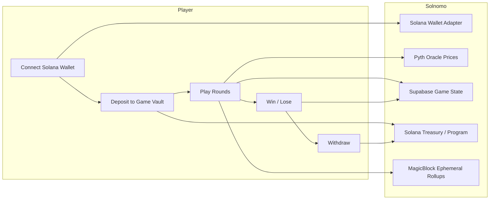
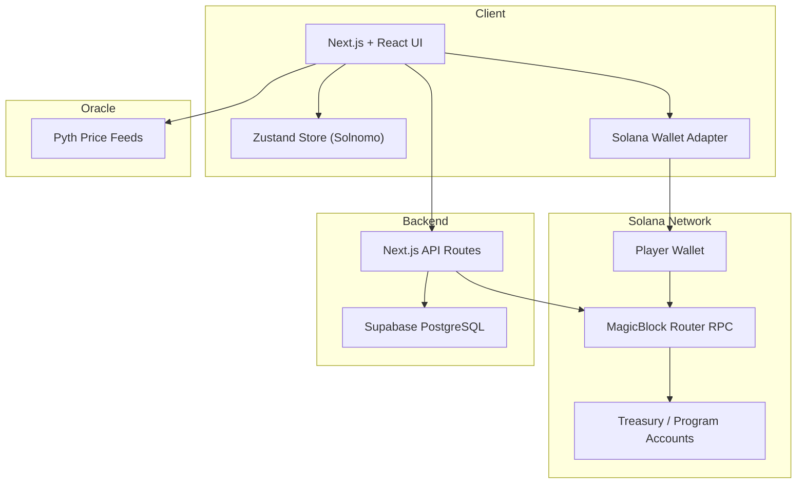
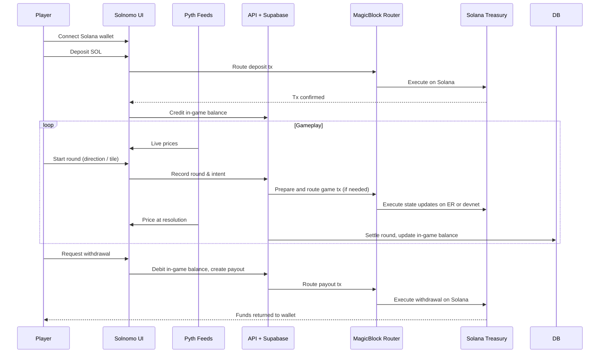
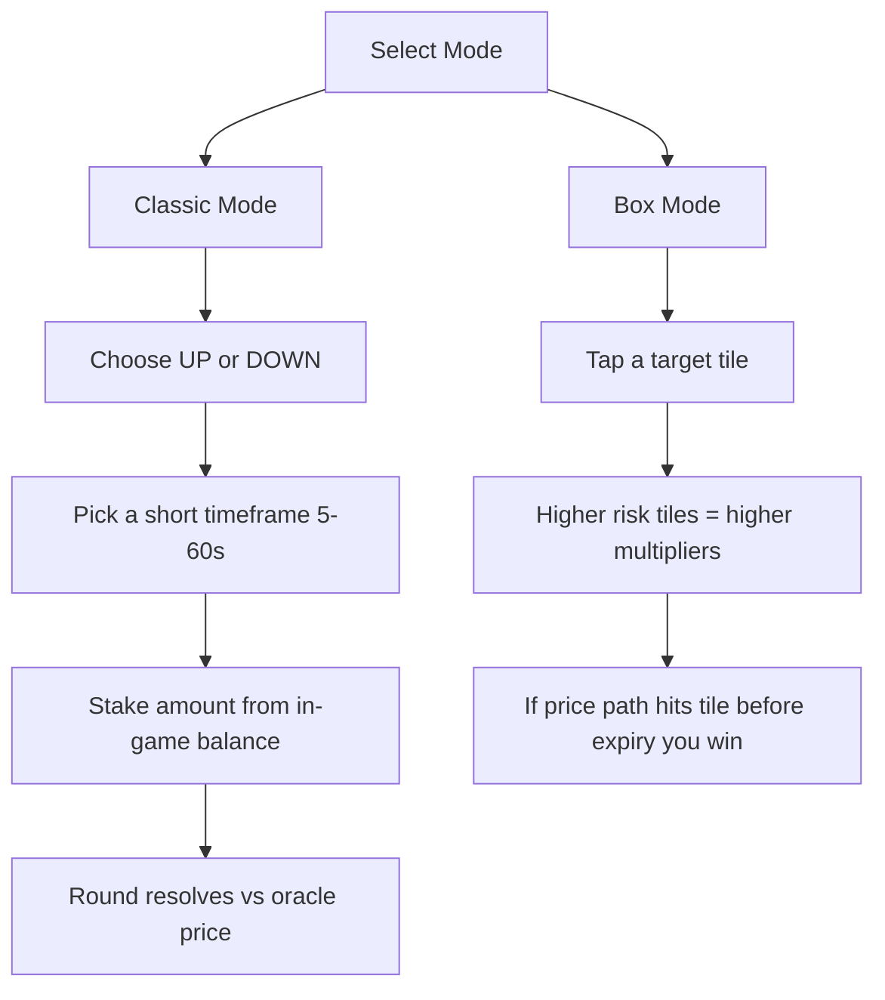

# Solnomo

**A Solana-native, MagicBlock-powered onchain game built for real-time rounds and instant settlement.**  
Running on **Solana devnet only**, aligned with the **Graveyard Hackathon** MagicBlock gaming track.

Powered by **Solana** + **MagicBlock Ephemeral Rollups** + **Pyth price feeds** + **Supabase**.

*Play short, oracle-resolved rounds with Web2-grade latency and onchain guarantees.*

---

## Why Solnomo?

Most onchain experiences feel like trading terminals: heavy, slow, and gas-bound.  
Solnomo focuses on **fast game loops** instead of leverage and perps.

- **Solana + MagicBlock**: Ephemeral Rollups give sub-50ms end-to-end latency with 1ms block times so rounds feel instant ([MagicBlock](https://magicblock.xyz/)).
- **Oracle-resolved rounds**: Pyth feeds provide high-frequency prices; game outcomes are verifiable onchain.
- **House-style in-game balance**: Deposit once, then play many rounds without signing every move.
- **Short sessions**: 5–60 second rounds that feel like a hyper-casual game rather than a derivatives UI.

---

## Market Opportunity

| Metric | Value |
|--------|--------|
| **Binary options / prediction (TAM)** | $27.56B (2025) → ~$116B by 2034 (19.8% CAGR) |
| **Crypto prediction markets** | $45B+ annual volume (Polymarket, Kalshi, on-chain) |
| **Crypto derivatives volume** | $86T+ annually (2025) |
| **Crypto users** | 590M+ worldwide |

---

## Competitive Landscape

| Segment | Examples | Limitation vs Solnomo |
|--------|----------|----------------------|
| **Web2 binary options** | IQ Option, Quotex | Opaque pricing, regulatory issues, no on-chain settlement; users do not custody funds. |
| **Crypto prediction markets** | Polymarket, Kalshi, Azuro | Event/outcome markets (e.g. "Will X happen?"), not sub-minute **price** binary options; resolution in hours or days. |
| **Crypto derivatives (CEX)** | Binance Futures, Bybit, OKX | Leveraged perps and positions; not short-duration binary options (5s–1m) with oracle-bound resolution. |
| **On-chain options / DeFi** | Dopex, Lyra, Premia | Standard options (calls/puts), complex UX; no simple "price up/down in 30s" binary product. |
| **Solana devnet binary options / prediction** | — | No established on-chain binary options dApp on Solana devnet; Solnomo fills this gap. |

**Solnomo's differentiation:** On-chain binary options on Solana devnet with sub-second oracle resolution (Pyth Hermes), house balance for instant bets, and dual modes (Classic + Box) in one treasury.

---

## Tech Stack

| Layer        | Technology |
|-------------|------------|
| **Frontend** | Next.js, React, TypeScript, Tailwind CSS, Zustand |
| **Blockchain** | **Solana devnet only**, MagicBlock Router (Ephemeral Rollups) |
| **Oracle** | Pyth price feeds on Solana |
| **Backend** | Next.js API Routes, Supabase (PostgreSQL) |
| **Storage** | Supabase for player state, history, and rewards |

---

## Core Loop (Game, not trading)



### Flow

1. **Connect** — Connect with a Solana wallet via Solana Wallet Adapter.
2. **Deposit** — Send SOL (or supported SPL assets) into a game treasury on Solana; your in-game balance is credited.
3. **Play round** — Choose direction and timeframe or tap a tile in Box Mode. The game engine runs via MagicBlock for ultra-low latency.
4. **Resolution** — The round resolves against a Pyth price; your in-game balance updates instantly.
5. **Withdraw** — Request withdrawal; funds are sent back to your Solana wallet.

---

## System Architecture (Solana + MagicBlock)



### Data Flow (Gameplay-focused)



### Game Modes



---

## Getting Started

### Prerequisites

- Node.js 18+
- Yarn (or npm)
- A Solana wallet (e.g. Phantom, Backpack) on **devnet** (app is devnet-only)
- Supabase project

### 1. Clone and install

```bash
git clone https://github.com/AmaanSayyad/solnomo.git
cd solnomo
yarn install
```

### 2. Environment variables

Copy the example env and fill in your values:

```bash
cp .env.example .env
```

Your `.env` should match this structure (see `.env.example`):

| Variable | Description |
|----------|-------------|
| **Solana Network** | |
| `NEXT_PUBLIC_SOLANA_NETWORK` | Must be `devnet` (app is Solana devnet-only) |
| `NEXT_PUBLIC_SOLANA_RPC_ENDPOINT` | Solana devnet RPC (e.g. `https://devnet-router.magicblock.app`) |
| **Treasury** | |
| `NEXT_PUBLIC_TREASURY_ADDRESS` | Solana treasury pubkey for in-game balances |
| `SOLANA_TREASURY_SECRET_KEY` | Treasury secret key (backend only; never commit real keys) |
| **Application** | |
| `NEXT_PUBLIC_APP_NAME` | App name in the UI (default: `Solnomo`) |
| `NEXT_PUBLIC_ROUND_DURATION` | Default round duration in seconds (e.g. `30`) |
| `NEXT_PUBLIC_PRICE_UPDATE_INTERVAL` | Price refresh interval in ms (e.g. `1000`) |
| `NEXT_PUBLIC_CHART_TIME_WINDOW` | Chart time window in ms (e.g. `300000`) |
| **Supabase** | |
| `NEXT_PUBLIC_SUPABASE_URL` | Supabase project URL |
| `NEXT_PUBLIC_SUPABASE_ANON_KEY` | Supabase anon key |

### 3. Supabase

1. Create a project at [supabase.com](https://supabase.com).
2. Run the SQL migrations in `supabase/migrations/` in the Supabase SQL Editor.

### 4. Run the app

```bash
yarn dev
```

Open [http://localhost:3000](http://localhost:3000); the app redirects to `/waitlist` and then to `/trade` for the main game.
